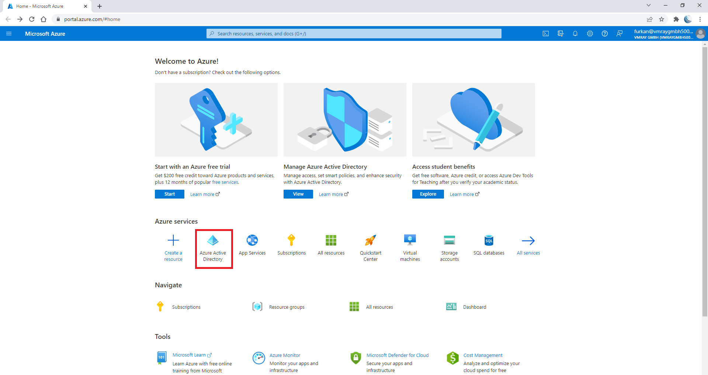

# Microsoft Defender for Endpoint Connector for VMRay Analyzer

**Latest Version:** 1.0 - **Release Date:** 02/23/2021

## Overview

This project is integration between Microsoft Defender for Endpoint and VMRay Analyzer. 
The connector will collect alerts and related evidences, and query or submit these samples into VMRay Sandbox.
After the submission, it retrieves IOC values from VMRay and submits them into Microsoft Defender for Endpoint.
It enriches alerts with metadata information retrieved from VMRay Analyzer.
If configured, the connector also can run automated actions like isolation, anti-virus scan, file quarantine, or collection investigation package.

## Project Structure

    app                                            # Main project directory
    ├─── config                                    # Configuration directory
    │   └─── __init__.py 			
    │   └─── conf.py                               # Connector configuration file
    ├─── db                                        # Directory for SQLite3 database
    ├─── downloads                                 # Directory for extracted binaries
    ├─── lib                                       # Library directory
    │   └─── __init__.py 				
    │   └─── MicrosoftDefender.py                  # Microsoft Defender for Endpoint API functions
    │   └─── VMRay.py                              # VMRay API functions
    │   └─── Models.py                             # Helper classes for data processing
    │   └─── Database.py                           # Helper classes for database
    ├─── log                                       # Log directory for connector
        └─── microsoft-defender-connector.log      # Log file for connector
    └─── __init__.py
    └─── connector.py                              # Main connector application
    └─── requirements.txt                          # Python library requirements

## Requirements
- Python 3.x with required packages ([Required Packages](app/requirements.txt))
- Microsoft Defender for Endpoint
- VMRay Analyzer
- Docker (optional)

## Installation

Clone the repository into a local folder.

    git clone https://github.com/vmray/ms-defender-ep-vmray-connector.git

Install the requirements.

    pip install -r requirements.txt

Update the [conf.py](app/config/conf.py) file with your specific configurations.

## Microsoft Defender for Endpoint Configurations

### Creating Application for API Access

- Open [https://portal.azure.com/](https://portal.azure.com) and `Azure Active Directory` service

- Click `App registrations`

- Click `New registration button`

- Enter the name of application and select supported account types.

- In the application overview you can see `Application Name`, `Application ID` and `Tenant ID`

- After creating the application, we need to set API permissions for connector. For this purpose,
  - Click `API permissions` tab
  - Click `Add a permission` button
  - Select `APIs my organization uses`
  - Search `WindowsDefenderATP` and click the search result

- On the next page select `Application Permissions` and check permissions according to the table below. And click `Add permissions` button below.

|       Category       |   Permission Name   |    Description   |
|:---------------------|:--------------------|:---------------- |
| Alert                | Alert.Read.All      | Needed to retrieve alerts and related evidence  |
| Alert                | Alert.ReadWrite.All | Needed to enrich alerts with sample information  |
| Machine              | Machine.CollectForensics | Needed to run collect investigation package action |
| Machine              | Machine.Isolate | Needed to isolate machine |
| Machine              | Machine.LiveResponse | Needed to gather evidences from machines |
| Machine              | Machine.Read.All | Needed to retrieve information about machines  |
| Machine              | Machine.Scan | Needed to run anti virus scan |
| Machine              | Machine.StopAndQuarantine | Needed to run stop and quarantine file job  |
| Ti                   | Ti.Read.All | Needed to retrieve indicators  |
| Ti                   | Ti.ReadWrite | Needed to retrieve and submit indicators (application specific)|
| Ti                   | Ti.ReadWrite.All | Needed to retrieve and submit indicators (general) |
| Library              | Library.Manage | Needed to upload custom ps1 script for retrieving av related evidences |

- After set the necessary permisions, click the `Grant admin consent for ...` button to approve permissions.

- We need to secrets to access programmatically. For creating secrets
  - Click `Certificates & secrets` tab
  - Click `Client secrets` tab
  - Click `New client secret` button
  - Enter description and set expiration date for secret

- Use Secret `Value` and `Secret ID` to configure connector.

**Reference**
- [https://docs.microsoft.com/en-us/microsoft-365/security/defender-endpoint/api-hello-world](https://docs.microsoft.com/en-us/microsoft-365/security/defender-endpoint/api-hello-world)

### Activating Live Response and Automated Investigation

- Open [https://security.microsoft.com](https://security.microsoft.com)
- Open `Settings` page and `Endpoint` tab
- Open `Advanced features`
- Activate `Automated Investigation`, `Live Response` and `Live Response for Servers` options

- Edit the 'MicrosoftDefenderConfig' class in [conf.py](app/config/conf.py) file.

| Configuration Item                                              | Description       | Default |
|:----------------------------------------------------------------|:-----------------------------------|:-------------|
| `API` > `TENANT_ID`                                             | Azure Active Directory Tenant Id |  |
| `API` > `APPLICATION_ID`                                        | Azure Application ID |  |
| `API` > `APPLICATION_SECRET_ID`                                 | Azure Application Secret ID |  |
| `API` > `APPLICATION_SECRET`                                    | Azure Application Secret | |
| `API` > `APPLICATION_NAME`                                      | Azure Application Name | `VMRayAnalyzerMicrosoftDefenderForEndpointIntegrationApp` |
| `API` > `AUTH_URL`                                              | Authentication Url to authenticate Azure Active Directory | `https://login.microsoftonline.com/<TENANT_ID>/oauth2/token` |
| `API` > `RESOURCE_APPLICATION_ID_URI`                           | Resource Application ID Uri to authenticate Azure Active Directory | `https://api.securitycenter.microsoft.com` |
| `API` > `URL`                                                   | URL to access Microsoft Defender for Endpoint API | `https://api.securitycenter.microsoft.com` |
| `API` > `USER_AGENT`                                            | User-Agent value to use for Microsoft Defender for Endpoint API | `MdePartner-VMRay-VMRayAnalyzer/4.4.1` |
| `DOWNLOAD` > `DIR`                                              | Download directory name | `downloads` |
| `ALERT` > `SEVERITIES`                                          | Selected Alert severities for filtering | [`UnSpecified`, `Informational`, `Low`, `Medium`, `High`] |
| `ALERT` > `STATUSES`                                            | Selected Alert statuses for filtering | [`Unknown`, `New`, `InProgress`, `Resolved`] |
| `ALERT` > `EVIDENCE_ENTITY_TYPES`                               | Selected Evidence entity types for filtering | [`File`] |
| `ALERT` > `MAX_ALERT_COUNT`                                     | Max alert count per request | `10000` |
| `MACHINE_ACTION` > `JOB_TIMEOUT`                                | Specific machine action job timeout as seconds | `180` |
| `MACHINE_ACTION` > `MACHINE_TIMEOUT`                            | Machine action timeout for machine itself | `300` |
| `MACHINE_ACTION` > `SLEEP`                                      | Sleep time for waiting the jobs as seconds | `30` |
| `MACHINE_ACTION` > `ISOLATION` > `ACTIVE`                       | Automated isolation status [`True`/`False`] | `False` |
| `MACHINE_ACTION` > `ISOLATION` > `VERDICTS`                     | Selected VMRay Analyzer verdicts to isolate machine | [`suspicious`,`malicious`] |
| `MACHINE_ACTION` > `ISOLATION` > `TYPE`                         | Type of isolation [`Full`/`Selective`] | `Full` |
| `MACHINE_ACTION` > `ISOLATION` > `COMMENT`                      | Comment for isolation job | `Isolate machine based on VMRay Analyzer Report` |
| `MACHINE_ACTION` > `ANTI_VIRUS_SCAN` > `ACTIVE`                 | Automated anti virus scan status [`True`/`False`] | `False` |
| `MACHINE_ACTION` > `ANTI_VIRUS_SCAN` > `VERDICTS`               | Selected VMRay Analyzer verdicts to run anti virus scan | [`suspicious`,`malicious`] |
| `MACHINE_ACTION` > `ANTI_VIRUS_SCAN` > `TYPE`                   | Type of anti virus scan job [`Full`/`Quick`] | `Full` |
| `MACHINE_ACTION` > `ANTI_VIRUS_SCAN` > `COMMENT`                | Comment for anti virus scan job | `Run anti virus scan based on VMRay Analyzer Report` |
| `MACHINE_ACTION` > `STOP_AND_QUARANTINE_FILE` > `ACTIVE`        | Stop and Quarantine File action status [`True`/`False`] | `False` |
| `MACHINE_ACTION` > `STOP_AND_QUARANTINE_FILE` > `VERDICTS`      | Selected VMRay Analyzer verdicts to stop and quarantine file | [`suspicious`,`malicious`] |
| `MACHINE_ACTION` > `STOP_AND_QUARANTINE_FILE` > `COMMENT`       | Comment for stop and quarantine file job | `Stop and quarantine files based on VMRay Analyzer Report` |
| `MACHINE_ACTION` > `COLLECT_INVESTIGATION_PACKAGE` > `ACTIVE`   | Collect investigation package action status [`True`/`False`] | `False` |
| `MACHINE_ACTION` > `COLLECT_INVESTIGATION_PACKAGE` > `VERDICTS` | Selected VMRay Analyzer verdicts to collect investigation package | [`suspicious`,`malicious`] |
| `MACHINE_ACTION` > `COLLECT_INVESTIGATION_PACKAGE` > `COMMENT`  | Comment for collect investigation package job | `Collect forensic investigation package based on VMRay Analyzer Report` |
| `INDICATOR` > `ACTION`                                          | Action for indicators which created by connector | `Audit` |
| `INDICATOR` > `TITLE`                                           | Title for indicators which created by connector | `Indicator based on VMRay Analyzer Report` |
| `INDICATOR` > `DESCRIPTION`                                     | Description for indicators which created by connector | `Indicator based on VMRay Analyzer Report` |
| `TIME_SPAN`                                                     | Alert polling time span as seconds | `3600` |

## VMRay Configurations

- Create API Key with web interface. (`Analysis Settings > API Keys`)

- Edit the `VMRayConfig` class in [conf.py](app/config/conf.py) file.

| Configuration Item  | Description       | Default |
|:--------------------|:-----------------------------------|:-------------|
| `API_KEY_TYPE`| Enum for VMRay API Key Type [`REPORT`/`VERDICT`] | `REPORT` |
| `API_KEY`| API Key |  |
| `URL`| URL of VMRay instance | `https://eu.cloud.vmray.com` |
| `SSL_VERIFY`| Enable or disable certificate verification [`True`/`False`] | `True` |
| `SUBMISSION_COMMENT`| Comment for submitted samples | `Sample from VMRay Analyzer - Microsoft Defender for Endpoint Connector` |
| `SUBMISSION_TAGS`| Tags for submitted samples | `MicrosoftDefenferForEndpoint` |
| `ANALYSIS_TIMEOUT`| Timeout for submission analyses as seconds | `120` |
| `ANALYSIS_JOB_TIMEOUT`| Timeout for analysis job in wait_submissions as seconds| `300` |

## General Connector Configurations

- Edit the `GeneralConfig` class in [conf.py](app/config/conf.py) file.

| Configuration Item  | Description       | Default |
|:--------------------|:-----------------------------------|:-------------|
| `LOG_FILE_PATH`| Connector log file path | `microsoft-defender-connector.log` |
| `LOG LEVEL`| Logging verbosity level | `INFO` |
| `SELECTED_VERDICTS`| Selected verdicts to analyze | `suspicious,malicious` |
| `TIME_SPAN`| Time span between script iterations as seconds | `300` |
| `RUNTIME_MODE`| Runtime mode for script | `DOCKER` |

## Database Configurations

- Edit the `DatabaseConfig` class in [conf.py](app/config/conf.py) file.

| Configuration Item  | Description         | Default                |
|:--------------------|:--------------------|:-----------------------|
| `DB_DIR`| Database directory  | `db`                   |
| `DB_PATH`| Database file path  | `db.sqlite3`                 |
| `TABLE_NAME`| Database table name | `alert_evidences` |

## IOC Configurations

- Edit the `IOC_FIELD_MAPPINGS` in [conf.py](app/config/conf.py) file. You can enable or disable IOC types with comments.

| IOC Type | Description | Microsoft Defender for Endpoint Field Names |
|:--------------------|:-----------------------------------|:-------------|
| `ipv4`| Connected IPV4 address | `IpAddress` |
| `sha256`| SHA256 Hash value of file | `FileSha256` |
| `domain`| Connected domain | `DomainName` |
| `sha1`| SHA1 Hash value of file | `FileSha1` |
| `md5`| MD5 Hash value of file | `FileMd5` |

## Powershell Script Configuration

- Set the `$API_KEY` variable in [SubmitEvidencesToVmray.ps1](app/lib/SubmitEvidencesToVmray.ps1) file with VMRay API Key. This script automatically submits evidences that is quarantined by the Antivirus module of Microsoft Defender for Endpoint.

# Running the Connector

## Running with CLI

You can start connector with command line after completing the configurations. You need to set `RUNTIME_MODE` as `RUNTIME_MODE.CLI` in the `GeneralConfig`. Also you can create cron job for continuous processing.
    
    python connector.py

## Running with Docker

You can create and start Docker image with Dockerfile after completing the configurations. You need to set `RUNTIME_MODE` as `RUNTIME_MODE.DOCKER` in the `GeneralConfig`.

    docker build -t mde_connector .
    docker run -d -v $(pwd)/log:/app/log -v $(pwd)/db:/app/db -t mde_connector

After running the Docker container you can see connector logs in the log directory on your host machine.